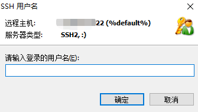

#### 1、近期（2022年3月份）安全厂商对内网服务器漏扫发现存在诸多漏洞，其中OpenSSH服务最为频繁（通过分析漏扫报告，只要是Linux服务器且开启默认ssh服务该服务器风险即为高危），漏洞详情如下：

 


#### 2、OpenSSH为Linux系统默认服务，提供远程管理功能，不建议关闭该服务，也不建议针对该服务进行防火墙限制（工作量及后期维护成本巨大），目前我部门提供了该服务的安全更新包，如下：
- CentOS7: [OpenSSH-8.9p1-1.el7.x86_64.rpm](./Software/OpenSSH-8.9p1-1.el7.x86_64.rpm) （MD5：d8fdee1e8eb0b997bca50965b3b46a5a）
- Ubuntu 18.04 LTS: [OpenSSH-8.9p1+bionic_amd64.deb](./Software/OpenSSH-8.9p1+bionic_amd64.deb) （MD5：d672c80471a4d77cbfd0ceca4b354605）
- Ubuntu 20.04 LTS: [OpenSSH-8.9p1+focal_amd64.deb](./Software/OpenSSH-8.9p1+focal_amd64.deb) （MD5：67d30fbbb0dcfbf96640af7d2ba37f6c） </p>
  (注意：CentOS默认允许root登录，更新时请先禁用selinux；Ubuntu默认禁止root登录，如需要允许root请调整配置文件)


#### 3、更新包具有以下特点： 
- 基于官网较新的 [openssh-8.9p1.tar.gz](https://mirrors.aliyun.com/pub/OpenBSD/OpenSSH/portable/openssh-8.9p1.tar.gz "openssh-8.9p1.tar.gz") 源码编译打包，编译参数：</p>
  `./configure --prefix=/usr/local/openssh --with-pam`

- 微调代码，隐藏了openssh服务版本 </p>


- 禁用aes cbc加密算法，统一采用： </p>
  `aes128-gcm@openssh.com,aes256-gcm@openssh.com,chacha20-poly1305@openssh.com,aes256-ctr`

- 开箱即用，直接安装即可，安装完后会取代系统默认的ssh服务，不会卸载旧版本openssh包
- 卸载更新包，恢复系统默认ssh服务

    
#### 4、安全更新操作：
- 基于CentOS7：
```shell
[root@local ~]# sed -i '/SELINUX/s/enforcing/disabled/' /etc/selinux/config && setenforce 0
[root@local ~]# rpm -ivh OpenSSH-8.9p1-1.el7.x86_64.rpm 
Preparing...                          ################################# [100%]
Updating / installing...
     1:OpenSSH-8.9p1-1.el7              ################################# [100%]
ssh-keygen: generating new host keys: RSA DSA ECDSA ED25519
```

- 基于Ubuntu 18.04 LTS：
```shell
root@local:~# dpkg -i OpenSSH-8.9p1+bionic_amd64.deb 
Selecting previously unselected package openssh.
(Reading database ... 71715 files and directories currently installed.)
Preparing to unpack OpenSSH-8.9p1+bionic_amd64.deb ...
Unpacking openssh (8.9p1+bionic) ...
Setting up openssh (8.9p1+bionic) ...
ssh-keygen: generating new host keys: RSA DSA ECDSA ED25519 
```

- 基于Ubuntu 20.04 LTS：
```shell
root@local:~# dpkg -i OpenSSH-8.9p1+focal_amd64.deb 
Selecting previously unselected package openssh.
(Reading database ... 154354 files and directories currently installed.)
Preparing to unpack OpenSSH-8.9p1+focal_amd64.deb ...
Unpacking openssh (8.9p1+focal) ...
Setting up openssh (8.9p1+focal) ...
ssh-keygen: generating new host keys: RSA DSA ECDSA ED25519
```


#### 5、OpenSSH服务配置调整（按需调整，一般默认即可）：
```shell
# vi /usr/local/openssh/etc/sshd_config     # 配置文件位于 /usr/local/openssh/etc 目录下
# systemctl restart sshd                    # 重启sshd服务
```


